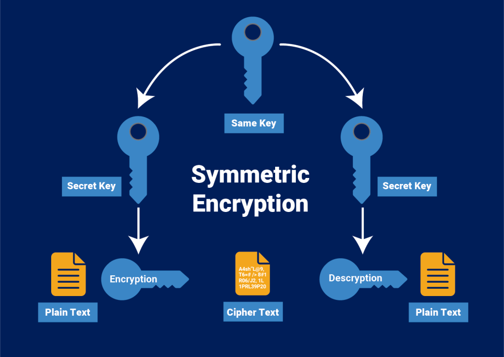

# Using AES for the Symmetric Encryption of Data

The goal of this tutorial is to explore the encryption of data using symmetric keys with the Advanced Encryption Standard (AES). We will make use of the functions provided by the SDK in order to encrypt data with a key, and then decrypt it again.



If you would like to learn more about AES encryption, here are some general resources that may help:

- [AES - Wiki](https://en.wikipedia.org/wiki/Advanced_Encryption_Standard)
- [GCM - Wiki](https://en.wikipedia.org/wiki/Galois/Counter_Mode)

The library supports GCM, a specific counter mode of AES that works well in many applications. The library also handles initialization vectors, automatically prepending them to ciphertext and removing them in the decryption process. Now that you know the basics, let's get started!

## Getting Started

First, let's import the `SymmetricKey` class from the SDK, and we'll also use `Utils` for human-readable messages.

```ts
import { SymmetricKey, Utils } from '@bsv/sdk'
```

Next, we wil define the keys to be used and the data to encrypt. They `.encrypt()` method expects a parameter of type `number[]` so we will use the Utils `toArray` function to convert the UTF8 message to the correct type.

```ts
  const symmetricKey = SymmetricKey.fromRandom()
  const messageToEncrypt = 'Hello Alice, this is Bob!'
```

### Encrypting and Decrypting

When you encrypt a message, an initialization vector is prepended to the message to prevent potential key re-use attacks. Conversely, when decrypting, the initialization vector that was initially added is spliced out and used in the AES-GSM decryption processes.

We will use the `encrypt` and `decrypt` methods of the SymmetricKey class to transform the message.

```ts
  const encryptedMessage = SymmetricKey.encrypt(messageToEncrypt)
  const plaintext = SymmetricKey.decrypt(encryptedMessage, 'utf8')
  // console.log(plaintext) --> 'Hello Alice, this is Bob!'

This is just a basic demonstration of symmetric encryption/decryption using the BSV SDK, however the possibilities of what you can do are endless once you understand these fundamentals.
